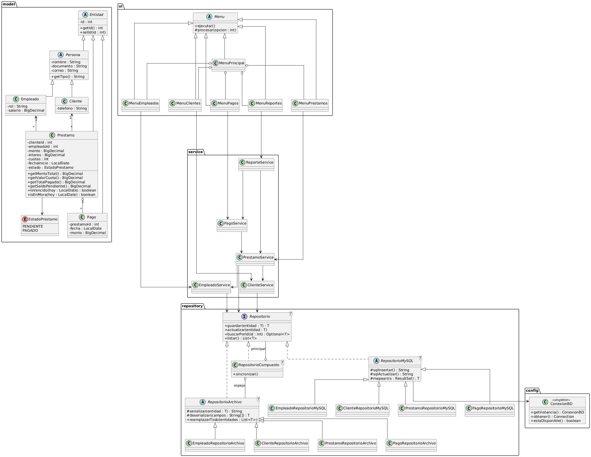

# CrediYa – Sistema de Cobros de Cartera

Aplicación de consola en **Java 17** para que **CrediYa S.A.S.** gestione empleados, clientes, préstamos, pagos y reportes de cartera, con persistencia simultánea en **archivos de texto** y **MySQL (JDBC)**.

## Características

- **Empleados**: registrar, listar, consultar por ID y buscar por nombre (`id, nombre, documento, rol, correo, salario`).
- **Clientes**: registrar, listar, consultar, buscar y ver los préstamos asociados (`id, nombre, documento, correo, telefono`).
- **Préstamos**: crear asociando cliente y empleado, cálculo automático del monto total con interés y de la cuota mensual, cambio de estado (`pendiente` / `pagado`).
- **Pagos**: registrar abonos, actualizar el saldo pendiente y consultar el histórico (por préstamo o general). Al saldar el préstamo pasa solo a `pagado`.
- **Reportes** (Lambda + Stream API): préstamos activos, pagados, vencidos y en mora, clientes morosos, saldo por cliente, colocación por empleado, préstamos con saldo mayor a un valor y totales de cartera.
- **Excepciones propias** (`ValidacionException`, `EntidadNoEncontradaException`, `PersistenciaException`) y validaciones de datos en la capa de servicio.

## Requisitos

- JDK 17 o superior
- Maven 3.8+
- MySQL 8+ (opcional: sin MySQL el sistema funciona solo con archivos de texto)

## Estructura del proyecto

```
crediya/
├── pom.xml
├── config.properties            conexión a MySQL
├── sql/
│   ├── crediya_db.sql           script ajustado (esquema)
│   └── datos_prueba.sql         datos de ejemplo
├── datos/                       archivos de texto generados
│   ├── empleados.txt
│   ├── clientes.txt
│   ├── prestamos.txt
│   └── pagos.txt
├── docs/
│   ├── diagrama-clases.png      diagrama UML
│   └── diagrama-clases.puml     fuente PlantUML
└── src/main/java/com/crediya/
    ├── Main.java
    ├── app/          composición de dependencias
    ├── config/       ConexionBD (Singleton)
    ├── exception/    excepciones propias
    ├── model/        Entidad, Persona, Empleado, Cliente, Prestamo, Pago, EstadoPrestamo
    ├── repository/   Repositorio<T>, RepositorioCompuesto<T>
    │   ├── archivo/  persistencia en archivos de texto
    │   └── mysql/    persistencia JDBC
    ├── service/      lógica de negocio y reportes
    ├── ui/           menús de consola
    └── util/         Validador, Formato
```

## Configuración de la base de datos

1. Ejecute el esquema:

   ```bash
   mysql -u root -p < sql/crediya_db.sql
   ```

2. (Opcional) cargue datos de ejemplo:

   ```bash
   mysql -u root -p < sql/datos_prueba.sql
   ```

3. Edite `config.properties` con su usuario y contraseña:

   ```properties
   db.url=jdbc:mysql://localhost:3306/crediya_db?useSSL=false&allowPublicKeyRetrieval=true&serverTimezone=UTC
   db.user=root
   db.password=su_clave
   ```

   También puede usar las variables de entorno `CREDIYA_DB_URL`, `CREDIYA_DB_USER` y `CREDIYA_DB_PASSWORD`, que tienen prioridad. **No suba su contraseña real a GitHub**: use las variables de entorno o deje `db.password` vacío en el repositorio.

### Cambios al script base

- `CREATE ... IF NOT EXISTS` para poder ejecutarlo más de una vez.
- Campos `NOT NULL`, `documento` único en empleados y clientes, y `estado` con valor por defecto `pendiente`.
- Restricciones `CHECK` (salario, monto, interés, cuotas, estado y abono positivos).
- `monto` de `pagos` ampliado a `DECIMAL(12,2)` para igualar al de `prestamos`.
- Llaves foráneas nombradas e índices sobre las columnas de consulta frecuente.

## Ejecución

Con Maven:

```bash
mvn compile exec:java
```

O generando el JAR ejecutable:

```bash
mvn clean package
java -jar target/crediya-1.0.0.jar
```

Ejecute siempre desde la carpeta raíz del proyecto, porque `config.properties` y `datos/` se leen con ruta relativa.

Al iniciar, el programa indica el modo de persistencia activo:

- **MySQL + archivos de texto**: MySQL es la fuente principal y los `.txt` se regeneran como espejo tras cada operación.
- **solo archivos de texto**: si MySQL no está disponible, el sistema sigue funcionando con la carpeta `datos/`.

> Si abre el sistema con MySQL disponible, los `.txt` se sobrescriben con el contenido de la base de datos.

## Reglas de negocio

| Concepto | Regla |
|---|---|
| Interés | Porcentaje **mensual simple** sobre el monto prestado |
| Monto total | `monto + monto × interés% × cuotas` |
| Cuota mensual | `monto total ÷ cuotas` |
| Saldo pendiente | `monto total − suma de abonos` |
| Vencimiento | `fecha de inicio + cuotas meses` |
| Préstamo vencido | Pendiente y con fecha de vencimiento ya superada |
| Préstamo en mora | Pendiente y con lo pagado por debajo de las cuotas exigibles a la fecha (una por cada mes cumplido desde el inicio) |
| Cliente moroso | Cliente con al menos un préstamo en mora |
| Abono | Mayor que cero, no mayor al saldo, no futuro y no anterior al inicio del préstamo |
| Cambio de estado | `pagado` solo con saldo en cero; `pendiente` solo si hay saldo |

Ejemplo: $1.000.000 al 2% mensual en 6 cuotas → total $1.120.000, cuota $186.666,67.

## Formato de los archivos de texto

Un registro por línea, campos separados por `|`, sin encabezado.

| Archivo | Campos |
|---|---|
| `empleados.txt` | `id\|nombre\|documento\|rol\|correo\|salario` |
| `clientes.txt` | `id\|nombre\|documento\|correo\|telefono` |
| `prestamos.txt` | `id\|clienteId\|empleadoId\|monto\|interes\|cuotas\|fechaInicio\|estado` |
| `pagos.txt` | `id\|prestamoId\|fecha\|monto` |

## Ejemplo de uso

```
=== CREDIYA S.A.S. - SISTEMA DE COBROS DE CARTERA ===
1. Empleados
2. Clientes
3. Prestamos
4. Pagos
5. Reportes
0. Salir
Seleccione una opcion: 3

=== MODULO DE PRESTAMOS ===
1. Crear prestamo
...
Seleccione una opcion: 1
ID del cliente: 1
ID del empleado: 1
Monto a prestar: 1000000
Interes mensual (%): 2
Numero de cuotas (meses): 6
Fecha de inicio (AAAA-MM-DD, Enter = 2026-10-01):
Prestamo creado con ID 5
Monto total con interes: $1,120,000.00
Valor de la cuota mensual: $186,666.67
```

Reporte de préstamos activos con los datos de prueba:

```
ID   CLIENTE                        MONTO INT/MES CUOTAS           TOTAL          CUOTA           SALDO ESTADO     VENCE      SITUAC.
1    Maria Fernanda Lopez   $1,000,000.00   2.00%      6   $1,120,000.00    $186,666.67     $520,000.00 pendiente  2026-09-01 VENCIDO
2    Jorge Andres Perez       $500,000.00   1.50%     12     $590,000.00     $49,166.67     $540,833.33 pendiente  2027-07-15 EN MORA
4    Luis Alberto Torres      $800,000.00   1.00%     10     $880,000.00     $88,000.00     $880,000.00 pendiente  2027-07-10 AL DIA
```

## Diagrama UML



## Principios y patrones aplicados

| Elemento | Dónde |
|---|---|
| Herencia | `Entidad` → `Persona` → `Empleado` / `Cliente`; `Entidad` → `Prestamo` / `Pago` |
| Polimorfismo | `Persona.getTipo()`, `Repositorio<T>`, `Menu.procesar()` |
| Encapsulamiento | Atributos privados y objetos inmutables salvo `id`, `estado` y `pagos` |
| Colecciones | `List`, `Map`, `Set` en servicios y reportes |
| Archivos | `RepositorioArchivo<T>` con `java.nio.file` |
| JDBC | `RepositorioMySQL<T>` con `PreparedStatement` y try-with-resources |
| Lambda y Stream API | `ReporteService`, `PrestamoService.filtrar(Predicate)` |
| Singleton | `ConexionBD` |
| Template Method | `RepositorioArchivo`, `RepositorioMySQL`, `Menu` |
| Composite / Espejo | `RepositorioCompuesto` (MySQL principal + archivo espejo) |
| Inyección de dependencias | `Aplicacion` ensambla repositorios, servicios y menús |
| SRP | Modelo, repositorios, servicios y UI en paquetes separados |
| OCP | Nuevos reportes o repositorios sin tocar el código existente |
| LSP | Cualquier `Repositorio<T>` es intercambiable |
| ISP | Interfaz `Repositorio<T>` mínima |
| DIP | Los servicios dependen de `Repositorio<T>`, no de implementaciones |

## Publicar en GitHub

```bash
git init
git add .
git commit -m "CrediYa: sistema de cobros de cartera"
git branch -M main
git remote add origin https://github.com/<usuario>/crediya.git
git push -u origin main
```
